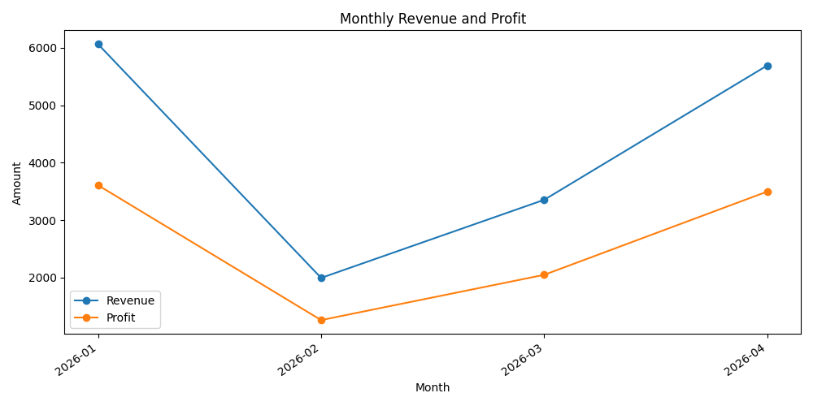
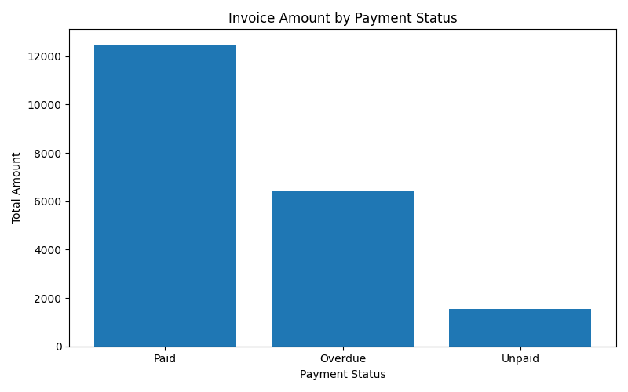
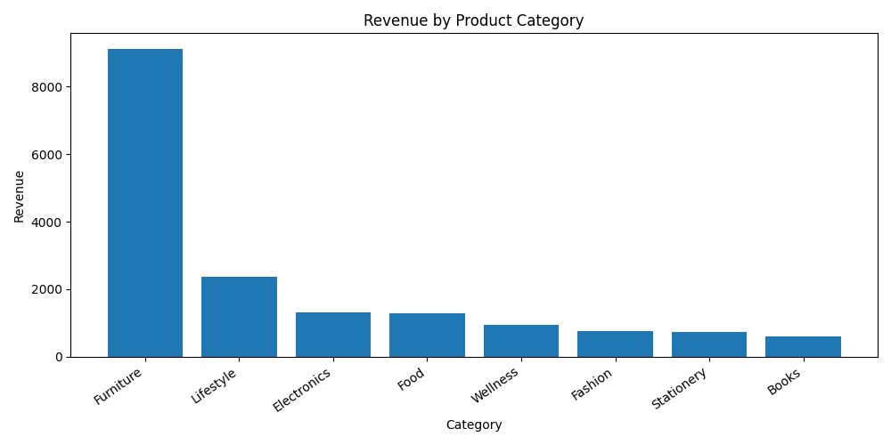

# Invoice Reporting & Business Analytics System

Python automation project for invoice analysis, sales tracking, and automated PDF reporting.

## Features

- Invoice and sales data analysis with Pandas
- Automated business KPI calculations
- Sales performance visualization with Matplotlib
- PDF report generation
- Excel output automation
- Customer and product analytics

## Technologies

- Python
- Pandas
- Matplotlib
- OpenPyXL
- FPDF

## Project Workflow

1. Read Excel invoice and sales datasets
2. Clean and process business data
3. Generate analytics and KPIs
4. Create charts automatically
5. Export PDF business reports
6. Save processed Excel outputs

---

## Preview

### Sales Performance Dashboard

### Automated PDF Report

### Revenue By Category

